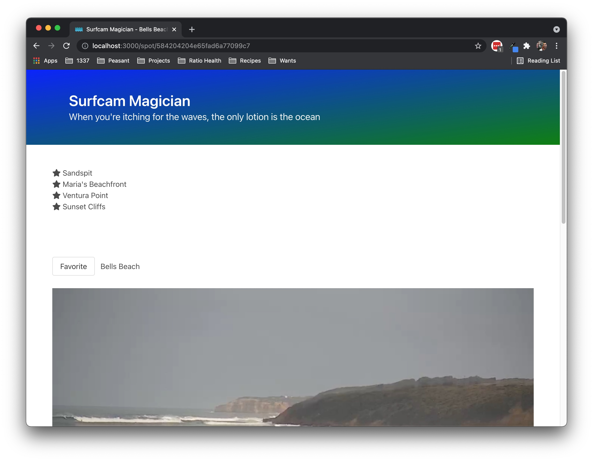
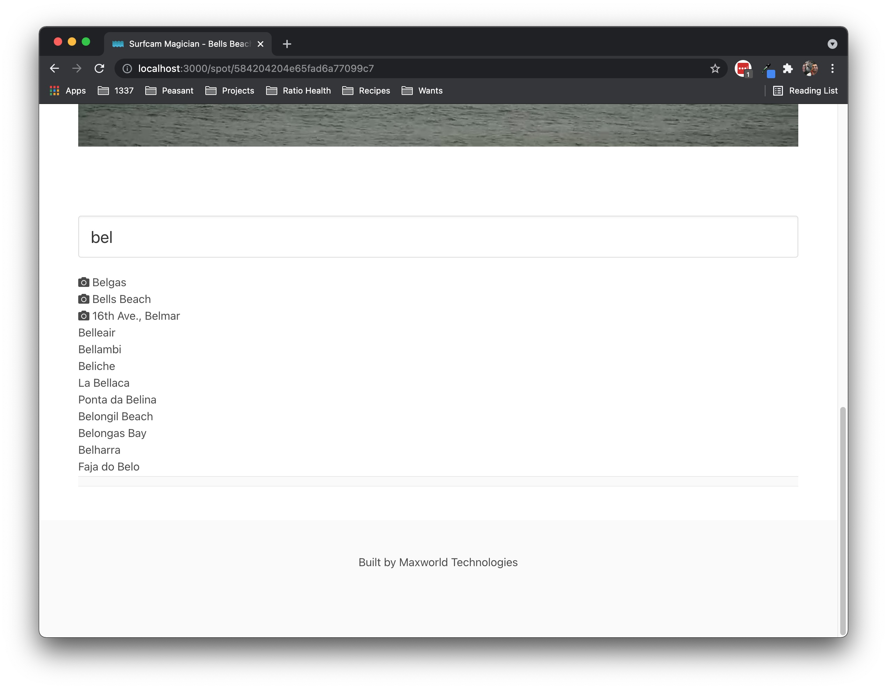
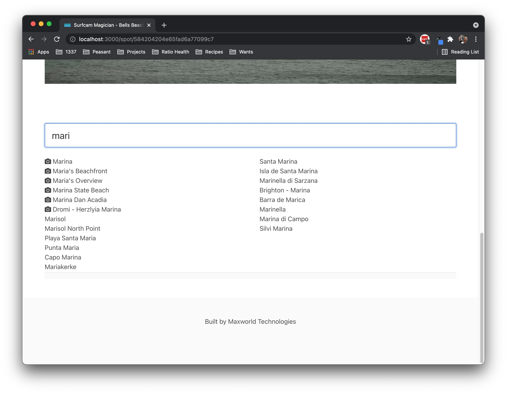

# Surfcam Magician

Watch HD surfcams

## More Info

This app demonstrates how to translate a Surfline spot URL into the spot's surfcam stream URL and play that stream using an open source video player (Surfline uses JW Player; a proprietary video player).

## How to Deploy

The static site is hosted on Netlify and deployed via their CD pipeline.

## How to Run Locally

Like any `create-react-app`-based app, use:

```sh
yarn start
```

## Credits

Icon made by [Freepik](https://www.flaticon.com/authors/freepik) from [www.flaticon.com](https://www.flaticon.com/).

Quotes by [Uncle Tito](https://rocketpower.fandom.com/wiki/Tito_Makani).

## Screenshots






